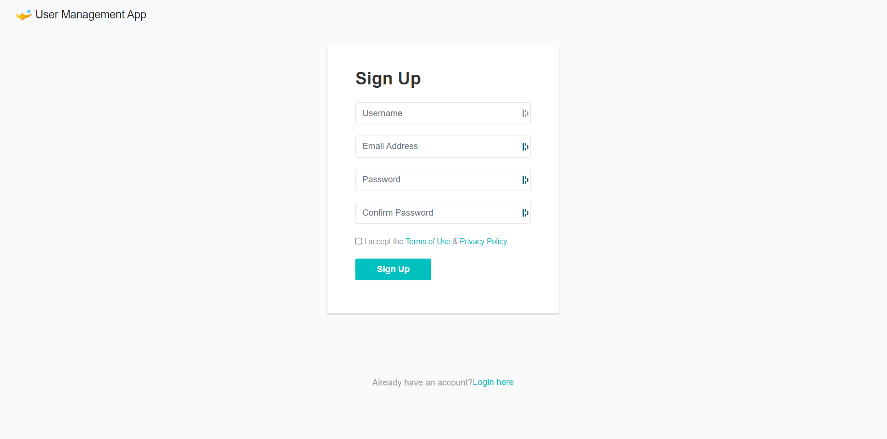

# StaffManagement-App

---

This is a java web application for managing your Staff Data.

### Technologies & tools used :
* Java SE 11
* Hibernate framework
* MySQL Database
* Servlet
* Maven

### How to setup on your local machine?
* Open the POM.xml file in you IDE ( Preferably IntelliJ IDEA )
 
* Setup your MySQL database
 
* Edit the hibernate.cfg.xml file (Change Password and username)
    * Make sure to use same mysql connector version or the compatible one.
    * If you want to use different Database (postgresQL or Oracle) change the dialect, Url and driver class in hibernate config file

### Points to remember (For Dev)
* If you are developing a web application using maven save the hibernate.cfg.xml file int the resource directory.
* Every class should have a no argument constructor, even in the embedded classes.
* Use \<property name="hbm2ddl.auto">create\</property> to drop the previous table and create a new table every time.
* Default local port for MySQL data base : 3306

