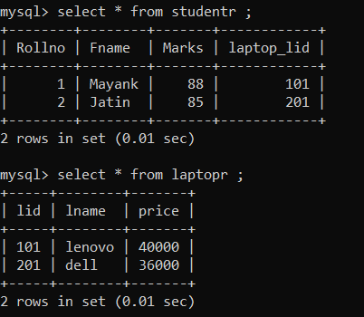
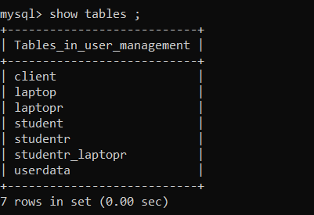

### One to Many
* A Student can have multiple laptop (one-to-many)

### One to One
* When you are doing one to one mapping you basically have to do two things 
    1. In students class you have to make a variable of laptop data type. This will create a new column in the students table, this column is the lid colunm of the laptop table which is a foreign key in the student table this helps in mapping.(If you are using @OneToOne in the sudents table then the lid is added in the students table and if you are using this annotation in laptop than roll(primary key) is added in the laptop table for foreign key)
    2. When You are making an student object to save you have to specify the laptop object to get its lid connected.
    

### One to Many 
* This is used when we want to connect the one object to multiple objects of different types (linking one row to multiple rows of different table)
   
   
  1. Method One (A separate table is created for linking) 
    instead of creating a single object of LaptopR you have to create a List <LaptopR> and the rest is same.
      
      
     
      
      
     Note: If you define the 
  2. Method Two ( Mapping in the same table )